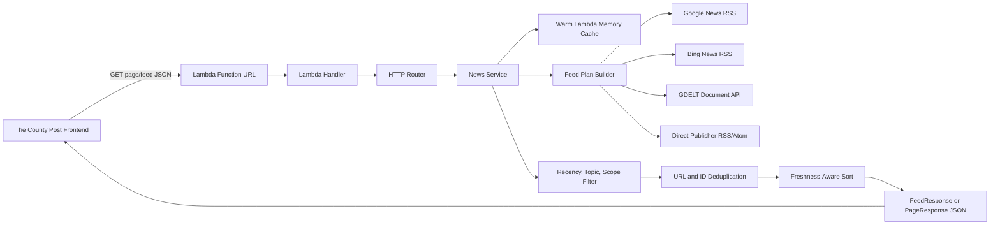
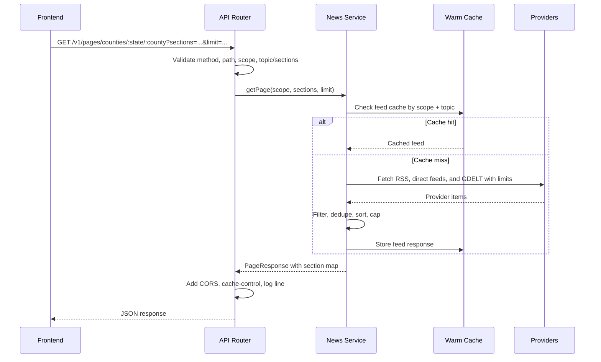
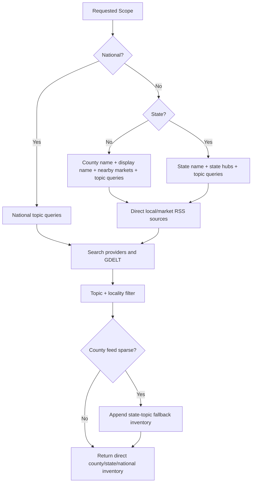
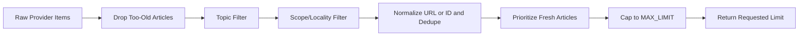
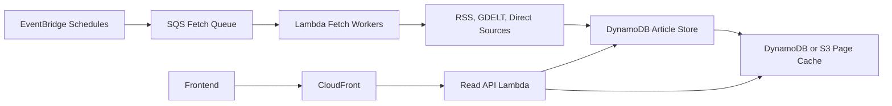

# County Post News API Comprehensive Guide

This document is the main technical reference for The County Post News API. It explains what the service does, how requests move through the system, how the deployed Lambda should be configured, and how the frontend should consume it.

## Executive Summary

The County Post News API is a low-cost server-side aggregation layer for national, state, and county news. It exists so the React frontend does not need to make dozens of browser-side RSS and search requests for each page load.

The API currently runs as a Node.js 20 AWS Lambda behind a public Lambda Function URL. It aggregates from Google News RSS, Bing News RSS, GDELT, and direct publisher RSS/Atom feeds, then filters, deduplicates, sorts, caches, and returns sectioned JSON to the frontend.

| Area | Current Shape | Why It Matters |
| --- | --- | --- |
| Runtime | Node.js 20 Lambda, ARM64 | Low-cost serverless deployment with no always-on server. |
| Public entry point | Lambda Function URL | Simple HTTPS URL for the frontend. |
| Storage | Warm in-memory cache only | Cheap first deployment; cache is lost on cold starts. |
| Providers | Google News RSS, Bing News RSS, GDELT, direct feeds | Gives broad coverage without paid provider keys. |
| Frontend integration | `VITE_NEWS_API_URL` points to Lambda URL | Keeps aggregation out of the browser. |
| CORS | Application-controlled allowlist | Avoids duplicate CORS headers from Lambda Function URL config. |
| Deployment | GitHub -> CodeBuild -> CloudFormation | AWS-managed pipeline, not GitHub Actions. |

## System Architecture



The core design goal is to make the frontend request one API endpoint per page view whenever possible. A page endpoint returns multiple named sections in one response, while feed endpoints return a single topic for one scope.

## Repository Map

| Path | Purpose |
| --- | --- |
| `src/handler.ts` | AWS Lambda entry point. |
| `src/local-server.ts` | Local development HTTP server. |
| `src/http.ts` | Routing, CORS headers, response formatting, request logging. |
| `src/news-service.ts` | Fetch orchestration, cache use, filtering, dedupe, page aggregation, county fallback. |
| `src/feed-builders.ts` | Builds provider URLs and search queries for national, state, and county scopes. |
| `src/filter.ts` | Topic and locality filtering. |
| `src/geo.ts` | State/county lookup and market-city expansion. |
| `src/source-registry.ts` | Direct source registry for publisher RSS/Atom feeds. |
| `src/rss.ts` | RSS/Atom fetch and parse logic. |
| `src/gdelt.ts` | GDELT Document API fetch and normalization. |
| `src/cache.ts` | Warm-memory cache helper. |
| `template.yaml` | AWS SAM template for Lambda Function URL deployment. |
| `buildspec.yml` | CodeBuild install, test, build, SAM package steps. |
| `tests/http.test.ts` | API behavior tests. |
| `docs/deployment.md` | Console deployment walkthrough and AWS troubleshooting. |
| `docs/news-coverage-strategy.md` | Coverage strategy and future coverage improvements. |
| `docs/roadmap.md` | Near-term roadmap. |

## Request Flow



## API Endpoints

| Endpoint | Description | Typical Frontend Use |
| --- | --- | --- |
| `GET /health` | Health and uptime check. | Deployment smoke test. |
| `GET /v1/states` | Returns known state slugs. | Navigation or validation. |
| `GET /v1/feeds/national/:topic` | One national topic feed. | Detail or fallback section loads. |
| `GET /v1/feeds/states/:stateSlug/:topic` | One state topic feed. | Detail or fallback section loads. |
| `GET /v1/feeds/counties/:stateSlug/:countySlug/:topic` | One county topic feed. | Detail or fallback section loads. |
| `GET /v1/pages/national` | Multiple national sections. | National homepage load. |
| `GET /v1/pages/states/:stateSlug` | Multiple state sections. | State page load. |
| `GET /v1/pages/counties/:stateSlug/:countySlug` | Multiple county sections. | County page load. |

Supported topics:

| Topic | Intended Coverage |
| --- | --- |
| `general` | Local, state, national, breaking, and top stories. |
| `sports` | School, college, professional, and community sports. |
| `politics` | Government, elections, legislature, commissions, councils. |
| `economy` | Business, jobs, development, housing, markets, industry. |
| `crime` | Courts, police, sheriff, arrests, public safety, trials. |
| `obituaries` | Obituaries, funerals, death notices. |
| `opinion` | Editorials, columns, commentary, op-eds. |

## Response Shapes

Single feed response:

```json
{
  "scope": { "level": "county", "stateSlug": "texas", "countySlug": "potter" },
  "topic": "general",
  "items": [
    {
      "id": "example-id",
      "title": "Example headline",
      "link": "https://example.com/story",
      "source": "Example Daily",
      "publishedAt": "2026-06-29T12:00:00.000Z",
      "description": "Story summary",
      "imageUrl": "https://example.com/image.jpg",
      "mediaType": "article"
    }
  ],
  "meta": {
    "count": 1,
    "sourcesUsed": ["county", "provider:bing-news-rss"],
    "fetchedAt": "2026-06-29T12:00:00.000Z",
    "cacheTtlSeconds": 30
  }
}
```

Page response:

```json
{
  "scope": { "level": "national" },
  "sections": {
    "general": {
      "scope": { "level": "national" },
      "topic": "general",
      "items": [],
      "meta": {
        "count": 0,
        "sourcesUsed": [],
        "fetchedAt": "2026-06-29T12:00:00.000Z",
        "cacheTtlSeconds": 30
      }
    }
  },
  "meta": {
    "count": 0,
    "fetchedAt": "2026-06-29T12:00:00.000Z",
    "cacheTtlSeconds": 30
  }
}
```

## Coverage Strategy

County coverage is intentionally broader than exact county-name matching. Rural and smaller counties often receive coverage from nearby market-city publishers, and articles may mention a city, school district, court, or sheriff office without naming the county in the headline.



Coverage rules:

| Rule | Current Behavior |
| --- | --- |
| County query expansion | Exact county variants, display name, state-qualified names, nearby market cities, and topic terms. |
| State query expansion | State name, state abbreviation, state market hubs, and topic terms. |
| National query expansion | Topic-specific national and United States queries. |
| Direct feeds | Publisher RSS/Atom feeds from `source-registry.ts` are merged with search providers. |
| Sparse county fallback | County-specific results stay first; state-topic articles fill the section when direct county inventory is low. |
| Unknown county handling | Unknown county slugs return `404` instead of guessed feeds. |

## Filtering, Deduplication, And Sorting



| Stage | Purpose |
| --- | --- |
| Recency cutoff | Drops articles older than `ARTICLE_MAX_AGE_DAYS`. |
| Topic filter | Keeps articles relevant to the requested section topic. |
| Scope filter | Keeps articles relevant to the requested national, state, or county scope. |
| Dedupe | Normalizes URLs, including Bing redirect URLs, before removing duplicates. |
| Freshness sort | Prioritizes recent articles in the `FRESHNESS_FOCUS_DAYS` window. |
| Limit cap | Builds and caches up to `MAX_LIMIT`, then slices per request limit. |

## Performance Model

The most important performance rule is that feed cache keys are independent of requested `limit`. The API builds a full cached feed per `scope + topic`, then slices it to the requested limit. This prevents repeated requests for `limit=48`, `limit=96`, and `limit=200` from triggering repeated provider fan-out.

Page endpoints aggregate several sections. To avoid overloading Lambda with too many simultaneous provider calls, page sections are processed with `PAGE_SECTION_CONCURRENCY`.

| Control | Default | Effect |
| --- | ---: | --- |
| `CACHE_TTL_SECONDS` | `30` | How long warm Lambda memory keeps feed results. |
| `REQUEST_TIMEOUT_MS` | `3500` | Per-provider fetch timeout. |
| `PAGE_SECTION_CONCURRENCY` | `2` | Number of page sections aggregated at once. |
| `UPSTREAM_CONCURRENCY` | `12` | Concurrent provider fetches within each provider group. |
| `MAX_RSS_URLS_PER_FEED` | `18` | RSS/search URL cap per section. |
| `MAX_ARTICLE_QUERIES_PER_FEED` | `6` | GDELT query cap per section. |
| `DEFAULT_LIMIT` | `48` | Default returned items per section. |
| `MAX_LIMIT` | `200` | Hard returned item cap. |

## CORS Model

CORS is handled by application response headers in `src/http.ts`.

| Setting | Requirement |
| --- | --- |
| Allowed origins | Set `CORS_ORIGINS` to comma-separated frontend origins. |
| Production origins | `https://main.d2z6lt4e5q50in.amplifyapp.com`, `https://thecountypost.com`, `https://www.thecountypost.com`. |
| Lambda Function URL CORS | Do not configure a separate `FunctionUrlConfig.Cors` block. |
| Trailing slashes | Do not include trailing slashes in origins. |
| Expected header | One `access-control-allow-origin` header echoing the matching frontend origin. |

Correct:

```text
Access-Control-Allow-Origin: https://thecountypost.com
Vary: Origin
```

Incorrect:

```text
Access-Control-Allow-Origin: https://thecountypost.com, https://thecountypost.com
```

Browsers reject duplicate or comma-joined `Access-Control-Allow-Origin` values.

## Deployment Pipeline

```mermaid
flowchart LR
  GitHub[GitHub main branch] --> CodePipeline[CodePipeline Source]
  CodePipeline --> CodeBuild[CodeBuild]
  CodeBuild --> Tests[Typecheck + Tests + Build]
  Tests --> SamBuild[SAM Build]
  SamBuild --> SamPackage[SAM Package to S3]
  SamPackage --> Packaged[packaged.yaml artifact]
  Packaged --> CloudFormation[CloudFormation Deploy]
  CloudFormation --> Lambda[Lambda Function URL]
  Lambda --> Output[NewsApiUrl Output]
```



The build pipeline must deploy `packaged.yaml`, not raw `template.yaml`. Raw `template.yaml` contains local `CodeUri: .`; `packaged.yaml` contains S3-backed Lambda code references created by `sam package`.

| File | Role In Deployment |
| --- | --- |
| `template.yaml` | Source SAM template. |
| `buildspec.yml` | CodeBuild install/test/build/package commands. |
| `packaged.yaml` | Generated deployment template consumed by CloudFormation. |
| S3 artifact bucket | Stores packaged Lambda artifact and pipeline artifacts. |
| CloudFormation stack | Creates/updates Lambda, function URL, role, and outputs. |

## AWS Resource Checklist

| Resource | Notes |
| --- | --- |
| CodeConnections connection | Must point to the GitHub repo and branch. |
| CodePipeline | Source -> Build -> Deploy. |
| CodeBuild project | Uses Node.js 20 and this repo's `buildspec.yml`. |
| Artifact bucket | Same region as pipeline and CodeBuild. |
| CloudFormation deploy role | Needs permission to create/update Lambda, IAM, logs, S3, and stack resources. |
| Lambda execution role | Created/managed by CloudFormation/SAM. |
| Lambda Function URL | Public API URL, exported as `NewsApiUrl`. |

## Frontend Integration

The frontend should set:

```text
VITE_NEWS_API_URL=https://<function-url-id>.lambda-url.<region>.on.aws/
```

Recommended frontend behavior:

| Page Type | Preferred API Call |
| --- | --- |
| National homepage | `GET /v1/pages/national?sections=general,sports,politics,economy,crime,obituaries,opinion&limit=96` |
| State page | `GET /v1/pages/states/:stateSlug?sections=general,sports,politics,economy,crime,obituaries,opinion&limit=96` |
| County page | `GET /v1/pages/counties/:stateSlug/:countySlug?sections=localNews,localSports,politics,economy,crime,obituaries,opinion&limit=96` |
| Section retry/detail | `GET /v1/feeds/.../:topic?limit=48` |

If the frontend still makes `api.rss2json.com` calls, check whether the API request failed first. The frontend fallback path intentionally keeps the page populated when the deployed API is unavailable.

## Operational Verification

Use these checks after every deployment.

| Check | Command | Expected Result |
| --- | --- | --- |
| Health | `curl "https://<api-url>/health"` | `200` with `{ "ok": true }`. |
| CORS | `curl -i -H "Origin: https://thecountypost.com" "https://<api-url>/health"` | Single `access-control-allow-origin: https://thecountypost.com`. |
| States | `curl "https://<api-url>/v1/states"` | `200` and state list. |
| National page | `curl "https://<api-url>/v1/pages/national?sections=general&limit=12"` | `200` and one section. |
| Full page | `curl "https://<api-url>/v1/pages/national?sections=general,sports,politics,economy,crime,obituaries,opinion&limit=96"` | `200` with populated section map. |
| Sparse county | `curl "https://<api-url>/v1/pages/counties/arkansas/polk?limit=48"` | `200`, no blank county page. |

## Request Logs

Each API request logs a JSON line:

```json
{
  "event": "api.request",
  "ok": true,
  "method": "GET",
  "path": "/v1/pages/counties/texas/potter",
  "query": "limit=48",
  "statusCode": 200,
  "durationMs": 842,
  "origin": "https://thecountypost.com",
  "referer": "https://thecountypost.com/texas/potter"
}
```

Page section failures are logged as warnings and converted to empty section responses so one provider/topic failure does not crash the whole page endpoint:

```json
{
  "event": "api.page.section_failed",
  "section": "crime",
  "topic": "crime",
  "error": "Example provider failure"
}
```

## Troubleshooting Matrix

| Symptom | Likely Cause | Fix |
| --- | --- | --- |
| `/health` works but page endpoint returns `502` | Lambda overloaded, timed out, or unhandled page-section failure. | Confirm latest deploy includes `PAGE_SECTION_CONCURRENCY`, `Timeout: 60`, and `MemorySize: 1024`; inspect CloudWatch logs. |
| Browser says duplicate `Access-Control-Allow-Origin` | CORS configured in both Lambda Function URL and application response. | Remove `FunctionUrlConfig.Cors`; keep only app-level CORS. |
| Frontend calls `api.rss2json.com` | Frontend fell back after API request failed or `VITE_NEWS_API_URL` is missing. | Fix API failure and confirm frontend env var is set to Lambda root URL. |
| Function URL path looks like `/health/v1/...` | Frontend API base URL was set with `/health` included. | Set `VITE_NEWS_API_URL` to the Lambda root URL only. |
| CodeBuild succeeds but artifact upload fails | CodeBuild role lacks S3 permissions for pipeline/artifact bucket. | Add `s3:PutObject`, `s3:GetObject`, and related bucket permissions. |
| CloudFormation says `CodeUri is not a valid S3 Uri` | Deploy action is using raw `template.yaml`. | Deploy CodeBuild output artifact `packaged.yaml`. |
| CloudFormation requires `CAPABILITY_AUTO_EXPAND` | SAM transform capability missing. | Add `CAPABILITY_IAM` and `CAPABILITY_AUTO_EXPAND`. |
| Lambda import module error | Handler path does not match compiled output. | Keep handler as `dist/src/handler.handler`. |
| Small county has no articles | Search providers did not return enough county-specific inventory. | Confirm county fallback is enabled and expand direct source registry. |

## Known Limitations

This first deployment is intentionally simple and inexpensive. It does not yet have durable article storage, scheduled refresh, or complete source coverage for every county.

| Limitation | Impact | Recommended Evolution |
| --- | --- | --- |
| Warm-memory cache only | Cold starts and new Lambda containers fetch providers again. | Add DynamoDB or S3-backed article/page cache. |
| Search-provider dependence | Rural/local stories can be missed. | Expand reviewed direct source registry. |
| No scheduled prefetch | First user after cache expiry waits on upstream providers. | Add EventBridge refresh jobs. |
| Limited diagnostics | Harder to see why a county has low inventory. | Add provider counts, filtered counts, newest article age. |
| No canonical article store | Duplicate/ranking improvements are limited to each request/cache window. | Store normalized article records by canonical URL. |

## Recommended Next Architecture



Recommended phases:

| Phase | Goal | Primary Additions |
| --- | --- | --- |
| Phase 1 | Stabilize current Lambda API | Page concurrency, CORS, tests, CloudWatch checks. |
| Phase 2 | Improve coverage | Reviewed direct source registry by county, state, and media market. |
| Phase 3 | Improve performance | Durable cache and scheduled prefetch. |
| Phase 4 | Improve ranking | Article scoring by county match, source quality, recency, topic fit. |
| Phase 5 | Improve observability | Coverage dashboards, provider health metrics, section inventory age. |

## Deployment Runbook

1. Push changes to the GitHub branch connected to CodePipeline.
2. Confirm CodePipeline source stage succeeds.
3. Confirm CodeBuild runs `npm ci`, typecheck, tests, build, `sam build`, and `sam package`.
4. Confirm CodeBuild output artifact contains `packaged.yaml`.
5. Confirm CloudFormation deploy stage uses the CodeBuild output artifact and `packaged.yaml`.
6. Confirm CloudFormation stack reaches `CREATE_COMPLETE` or `UPDATE_COMPLETE`.
7. Copy `NewsApiUrl` from stack outputs if needed.
8. Smoke test `/health`, CORS, `/v1/states`, one feed endpoint, and one full page endpoint.
9. Confirm the frontend deployment has `VITE_NEWS_API_URL` set to the Lambda root URL.
10. Hard refresh the frontend and verify page endpoint requests return `200`.

## Best Practices For Future Changes

| Practice | Reason |
| --- | --- |
| Keep browser aggregation out of the frontend | Browser-side provider fan-out is slower, leaks provider keys, and increases CORS risk. |
| Cache by scope/topic, not requested limit | Prevents infinite-scroll or larger limits from refetching providers. |
| Prefer direct sources when available | Direct feeds are more reliable for local same-day news. |
| Treat sparse counties as expected | Use nearby markets and state fallback instead of rendering empty sections. |
| Keep CORS in one layer | Duplicate CORS headers break browser fetches. |
| Make deploy changes through SAM | Keeps Lambda config, environment, and outputs reproducible. |
| Add tests for every routing or aggregation behavior change | Most bugs show up as frontend blanks, `502`, or unexpected fallback. |

